# Autonomous Rover
**Wheeled Rover for a Collaborative Off-Road Robot Team**
 
**L3Harris HAV Lab**
 
**Advisor: Dr. Sun**
 
**Role: Undergraduate Research Assistant**

<!-- HERO IMAGE: full rover photo or render -->
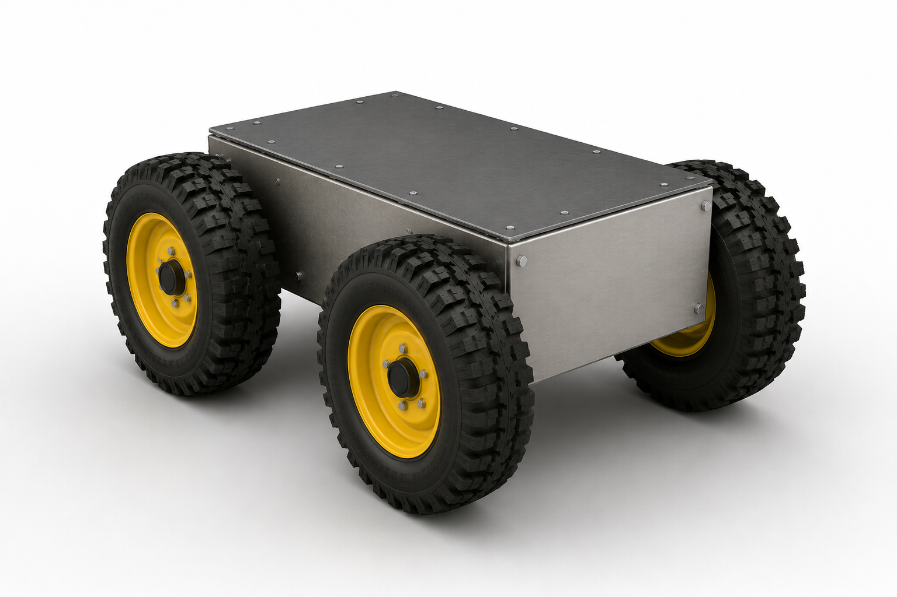

*CAD rendering of the rover design.*

## Overview

This project explores how a heterogeneous team of robots, each with a different physical skill set, can collaborate to traverse terrain that would exceed any single platform's individual capability. The core idea is that each robot in the team has different strengths, and by working together, they can lean on each other's strengths in situations where their own platform falls short, letting the team perform beyond what any single robot could accomplish alone.

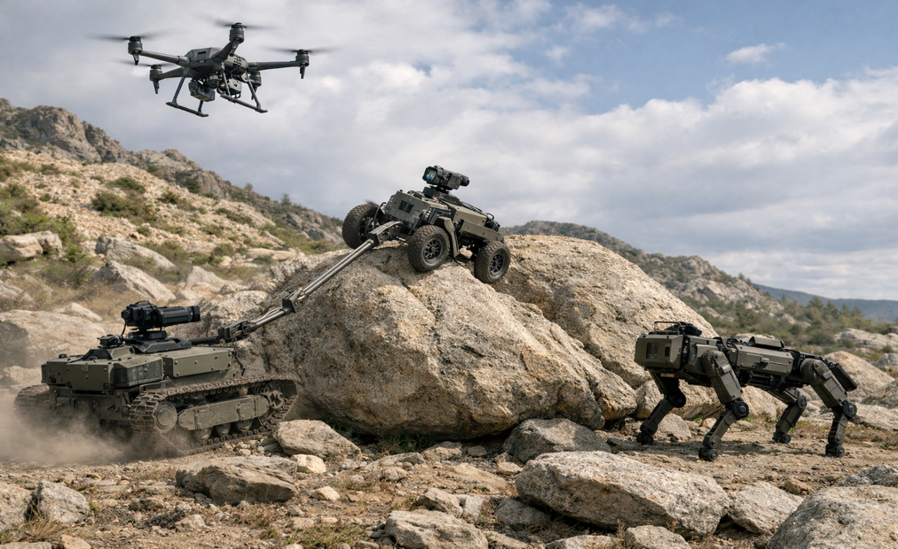

*Renderings of a heterogeneous robot team operating together.*

An early proof-of-concept demonstrated this directly: a wheeled robot, initially unable to move under an applied load, regains motion once a drone lifts a portion of that weight, reducing static friction enough for the robot to drive forward. As part of this work, I calibrated a RadioLink drone using ArduPilot and delivered a multi-robot coordination demonstration and presentation to the United States Army Research Lab.

<!-- PROOF OF CONCEPT VIDEO -->
https://github.com/user-attachments/assets/ae976bf7-49cf-4480-8de5-11d52da3f888

*Proof-of-concept demo: a wheeled robot under load, initially unable to move, regains traction and drives forward once a drone lifts a portion of the weight.*

Building on that proof of concept, the current phase of the project is the wheeled rover itself: a platform being built to operate autonomously, both on its own and as part of a team, physically pulling and being pulled by other robots when needed.

## Research Program

This work is part of a broader research effort, **Autonomous Cyber-Physical Vehicle Coordination on Complex Terrains**. My role: build and autonomize the wheeled rover, extend that autonomy to a legged platform, and develop a mechanism that lets robots physically connect to push or pull each other autonomously.

## Design & CAD

Before modeling anything, the rover's motor and material requirements were driven by the pull and be-pulled requirement: weight and torque calculations determined the motor sizing needed to both move the rover itself and tow another robot in the team. Those calculations set the material and component list below, which the CAD design was then built around.

*CAD design of the rover assembly featuring motors, wheels, and all electronic components.*

## Bill of Materials

| Component | Role | Spec | Photo |
|---|---|---|---|
| Drive Motor | Wheel drive, sized for pull/tow load | Flipsky 6374, 140KV, current-limited to 15A |  |
| ESC | Motor speed control | FLIPSKY Mini V6 MK5, VESC 6.6, aluminum anodized heat sink |  |
| Battery | Power | Zeee 6S LiPo, 10000mAh, 22.2V, 120C, EC5 connector |  |
| Chassis Material | Structural frame | Aluminum 6061-T6| 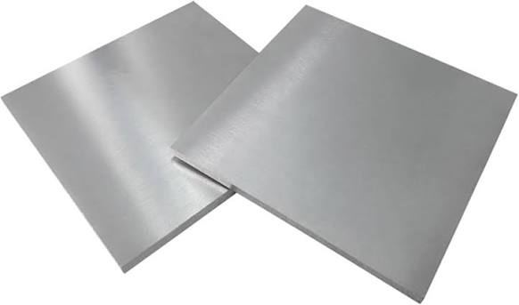 |

## Fabrication

The rover was fabricated in Villanova's machine shop using an angle grinder, drill press, lathe, 3D printer (PETG parts), and soldering iron. Lock nuts are used throughout to account for vibration during operation.

#### Chassis

https://github.com/user-attachments/assets/ddc288d6-379b-4fef-987a-e665b07f313f

*Chassis assembly, machined from aluminum using an angle grinder and drill press.*

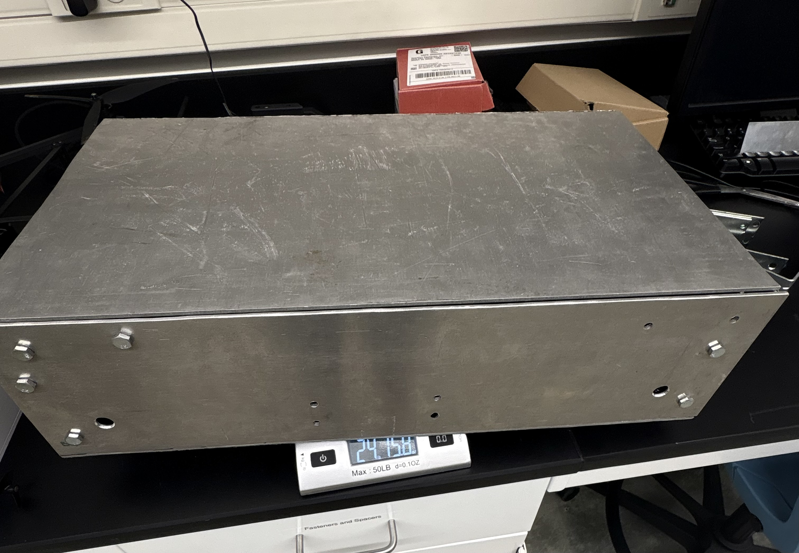

*Completed chassis with lid attached, ready for component mounting.*

#### Motor Mounting

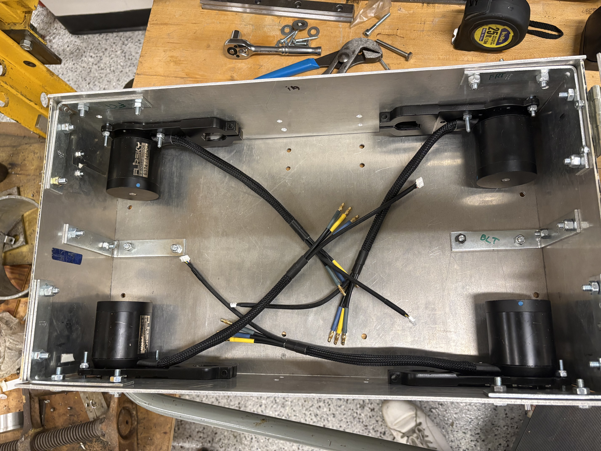

*Mounting holes were drilled with a  drill press directly into the aluminum chassis, and the motors were bolted to the chassis.*

#### Battery Holder & ESC Mounts

 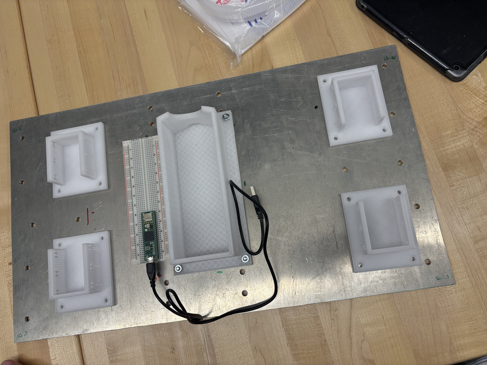

*The 3D-printed PETG battery holder and ESC mounts. Mounting holes were drill pressed and the parts secured to the bottom plate of the chassis.*

The battery mount uses M5 bolts (32 TPI, 1.5" length) into the PETG mount. The ESC mounts use a sliding fit tolerance to seat the ESCs securely while allowing for removal.

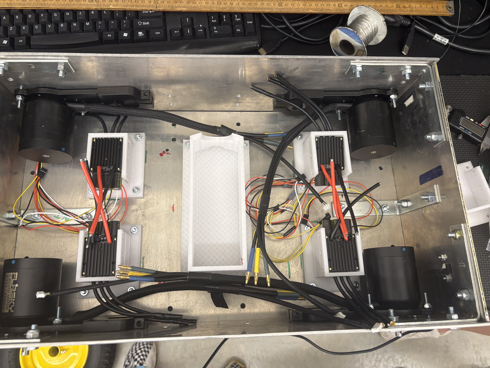

*Chassis with the ESC mounts installed and ESCs seated in place, ready for wiring.*

#### Wheel Attachment

Driving a wheel directly off the motor's output shaft was the first option considered, but analysis showed it wasn't a safe long-term solution: with the wheel mounted straight onto the motor shaft, the calculated factor of safety against shaft fatigue came out to roughly 0.9–1.1, right at or below the failure threshold. The fix was to add a dedicated outboard support bearing near the wheel, intercepting the bending load before it reaches the motor shaft or the motor's internal bearings, rather than relying on the motor shaft to carry that load alone. With the outboard bearing in place, the same analysis puts the shaft's factor of safety at roughly 3.45 under worst-case loading, a solid margin for a 50 lb, 4-wheel platform. As part of this analysis, the motor was disassembled to directly inspect its internals and characterize the actual load it could handle, rather than relying solely on manufacturer specs.

<strong>Coming soon: FEA analysis with Ansys (click to expand)</strong>

 

Structural validation of key components via Ansys FEA will be added here once complete.

<!-- FEA IMAGE: Ansys motor shaft stress/FOS results -->
<!--  -->
<!-- *Ansys FEA of the motor shaft under worst-case bending and torsional load, validating the hand-calculated factor of safety.* -->

<!--  -->

<!--*Rendering of the outboard-bearing wheel attachment design: a custom machined adapter connects the motor shaft to the wheel hub, with a support bearing and standoff bracket carrying the wheel's load into the chassis wall rather than back into the motor.*-->

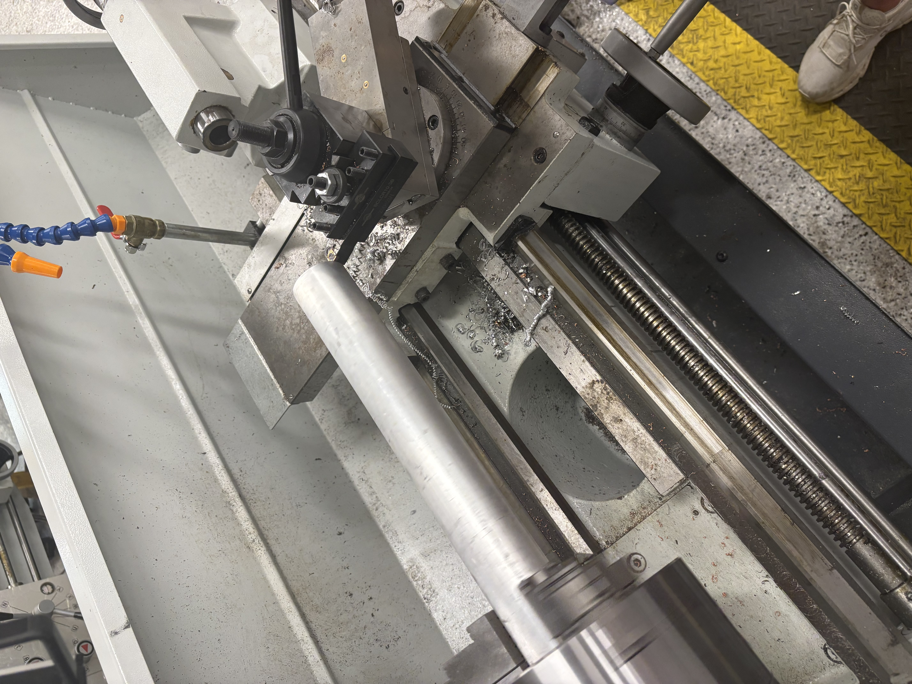&nbsp;&nbsp;&nbsp;&nbsp;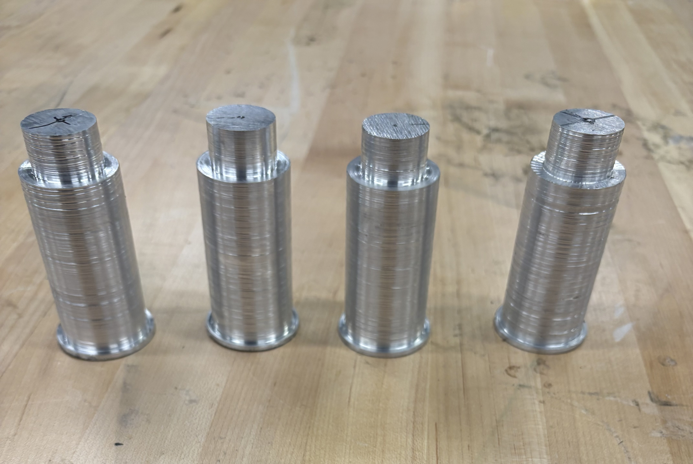

*The lathe used to machine the wheel attachment adapter (left), and the finished piece (right).*

Before trusting this under full driving load, the plan is to validate it with a static side-load bench test, then a powered on-stand run test, confirming the calculated design holds up under real conditions.

## Electronics & Testing

#### Wiring

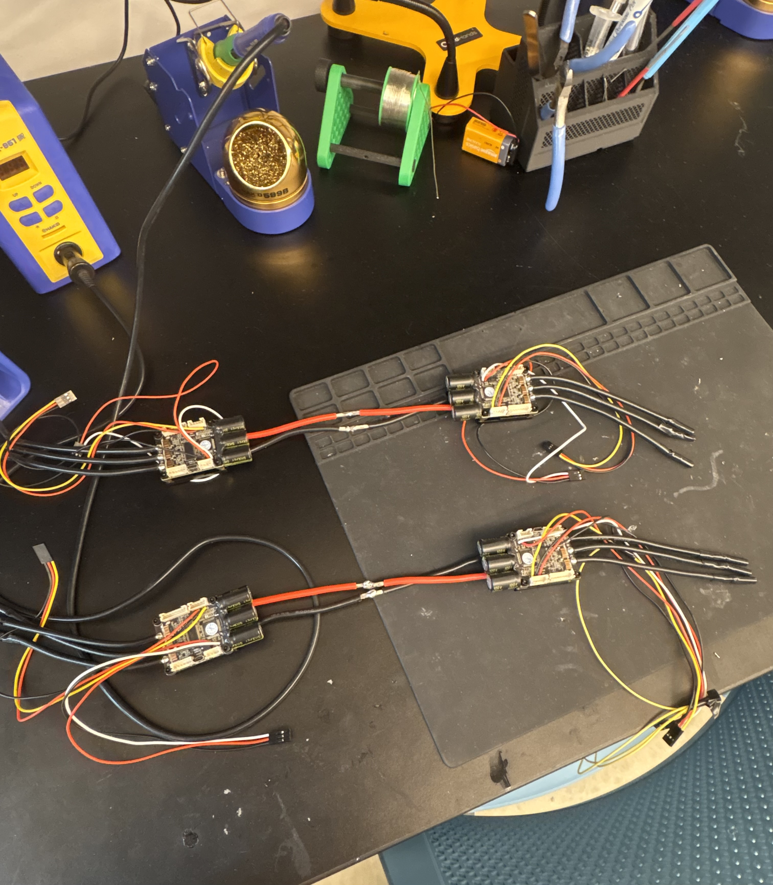&nbsp;&nbsp;&nbsp;&nbsp; 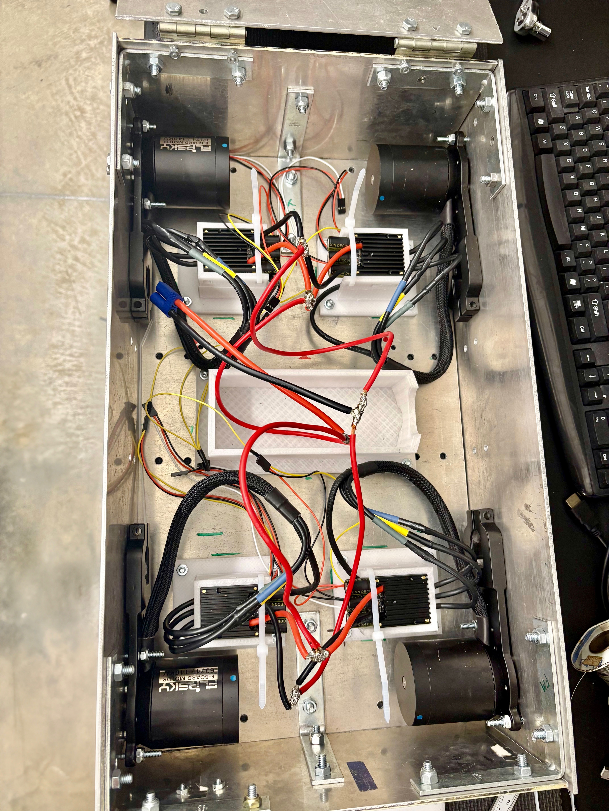

*The ESCs were soldered together and wired in parallel. This wiring was done without PWM signal splitting, a simpler approach that works for this stage of testing but isn't the most refined method; it's a known area for cleanup in a later iteration.*

#### ESC Configuration

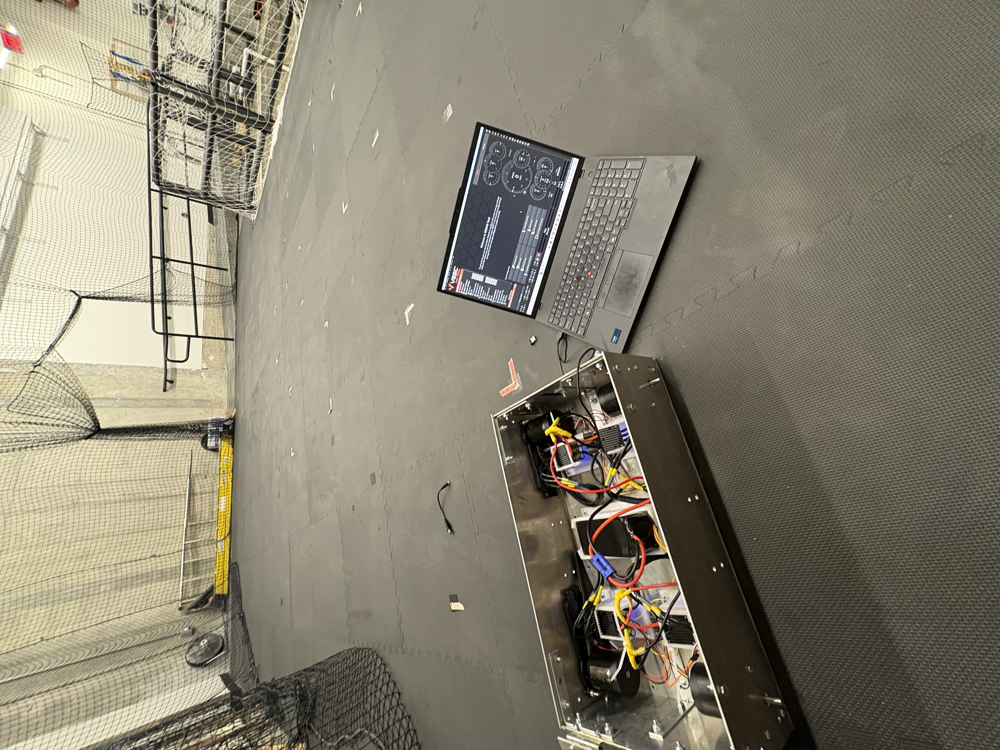

*ESC Configuration taking place using VESC Tool Software.*

https://github.com/user-attachments/assets/366e0a16-83fd-4b0e-9b47-df85c3f6d8a7

*ESC Configuration Test: a single motor spinning during a VESC Tool test, confirming the ESC is configured and responding correctly before testing the full drivetrain.*

#### Full Drive Train Test

All ESCs were soldered together, with their ground and signal wires tied to a single receiver's pins, to test simple forward/back motion using a receiver and transmitter to control the motors.

https://github.com/user-attachments/assets/157501a2-3318-4a4c-9c09-36679b82e03b

*Full drivetrain demo: all wheels turning together under receiver/transmitter control, confirming the drivetrain responds correctly across every motor.*

Controller responsiveness was confirmed through this test before moving on to sensing and autonomy.

<strong>Coming soon: wheels, LiDAR & autonomy (click to expand)</strong>

 

The next stage of the build, expected within the next few days, adds:

- **Wheels** mounted to the completed chassis and drivetrain
- **LiDAR** for terrain and obstacle sensing
- **Raspberry Pi** running simple optical detection

This section will be updated with photos, video, and results once that stage is complete.

## Status

The rover is under active development. Chassis fabrication and core drivetrain electronics (motors, wiring, ESCs) are complete and tested. The immediate next steps are attaching the wheels, integrating LiDAR, and implementing Raspberry Pi-based optical detection.

## Future Work

- **Wheel installation** and full drivetrain assembly with the outboard-bearing mount
- **Validation testing** of the wheel attachment: static side-load bench test followed by a powered on-stand run test
- **Ansys FEA** of the motor shaft and adapter, confirming the hand-calculated factor of safety against simulation
- **LiDAR integration** for terrain and obstacle sensing
- **Raspberry Pi optical detection** for basic obstacle/object recognition
- **Autonomous navigation** for the rover within the broader heterogeneous robot team
- **Wiring cleanup**, moving from the current parallel ESC wiring to a proper PWM-split configuration
- **Drive shaft with gear ratio**, a possible improvement over the current direct-drive setup for better torque control
- **Legged robot autonomy**, extending this work to a second platform type in the broader research program
- **Physical connection mechanism**, developing an arm that lets robots autonomously connect and push or pull each other
- **Field testing** of pull/tow capability with other team members
